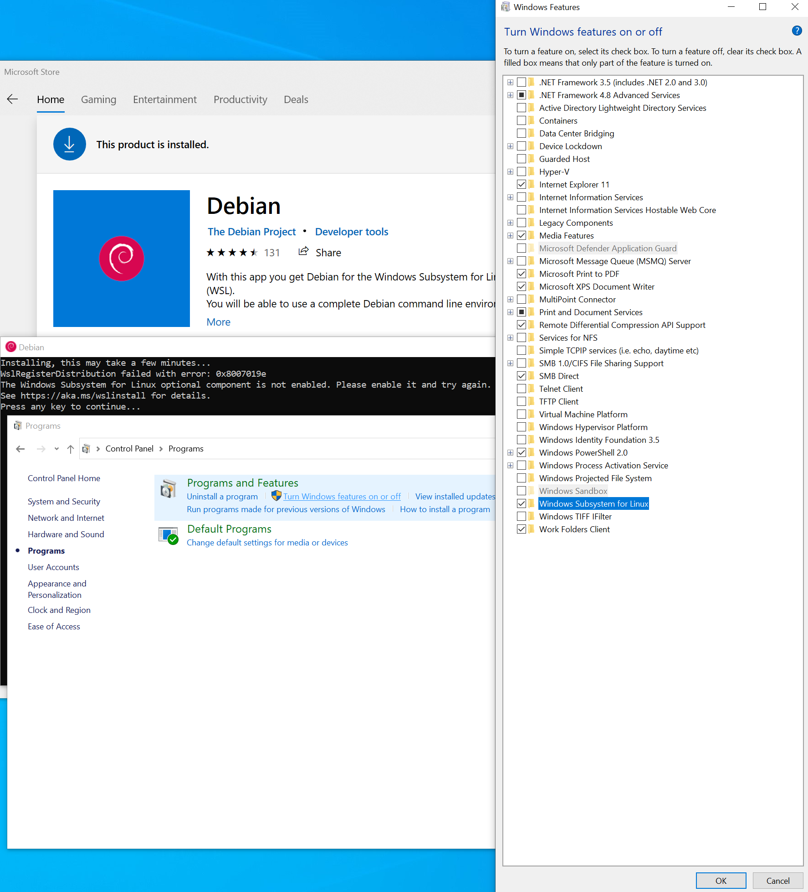

# Debug Things

# Issue 000001 (): If namespace deletion is stuck locally in docker desktop's kubernetes:
STATUS: 
This can be RESOLVED with manual click (see image below), but the TECH DEBT automation of this fix is TODO (I/We should automate this fix)
    - TODO (in order to automate the fix): need to find out the cli or api for hard resetting the local docker desktop kubernetes cluster and then add it to ansible and cli
        - HOW: to force stop all containers
        - WHY: root cause is coredns k8s containers (and similar) waiting forever for connections to drop
Example error: 
`Error from server (Forbidden): error when creating "STDIN": secrets "dockerhub" is forbidden: unable to create new content in namespace kubify`
Investigation:
- Find out what resources are left in the stuck namespace with: `kubectl api-resources --verbs=list --namespaced -o name | xargs -n 1 kubectl get --show-kind --ignore-not-found -n kubify`
    - Example Output: `error: unable to retrieve the complete list of server APIs: mutators.kubedb.com/v1alpha1: the server is currently unable to handle the request, validators.kubedb.com/v1alpha1: the server is currently unable to handle the request`
        - This was from an old typo in the api version, so I will create a PR to the public https://github.com/kubedb/operator repo to fix this and will try to get a workaorund in place in the meantime #TODO (Willy will take this task)
    - Helpful references of endpoints and versions: 
        - https://kubernetes.io/docs/reference/generated/kubernetes-api/v1.19/
        - https://kubedb.com/docs/v2021.03.17/guides/postgres/initialization/script_source/
    - RESOLUTION: I hard reset my local Docker Desktop's K8s to fix this:


# Issue 000002 (): If WSL2 Is Not Enabled (While Trying to Install Debian for Windows on Microsoft Store):
If WSL2 (Windows Feature) is not enabled: Control Panel -> Programs -> Turn Windows Features on -> Checkmark "Linux Sub-System for Windows", Click Ok, Click Restart (when prompted) -> Open Microsoft Store (or manually/silently using https://docs.microsoft.com/en-us/windows/wsl/install-manual) again and try install of Debian For Windows again:


#kubedb local reset
    docker docker settings -> resources -> make the disk size limit smaller -> apply (hard reset your k8s local stack for the win)
    and then reset helm
    ```
    rm -rf ~/.helm/cache/archive/*
    rm -rf ~/.helm/repository/cache/*
    # Refreash repository configurations
    helm repo remove appscode stakater jetstack architectminds
    helm repo update
    helm repo add appscode https://charts.appscode.com/stable/
    helm repo update
    helm install kubedb appscode/kubedb --version v2021.03.17 --namespace kube-system
    ```
#kubify up producing brew dnsmasq error
    # will fix this forsure, but for now if you run into it
    ```
    Error: The `brew link` step did not complete successfully
    Error: Directory not empty @ dir_s_rmdir - /usr/local/Cellar/dnsmasq/2.84
    ```
    # workaround is
    `brew unlink dnsmasq && brew link dnsmasq`

#kubectl apply gives schema missing command:
see https://kubernetes.io/docs/tasks/extend-kubernetes/custom-resources/custom-resource-definitions/
since kubernetes had some major breaking changes lately, we must adapt to apiv3 apiextensions yaml expected format, so we added:
```
      schema:
        openAPIV3Schema:
          type: object
          properties:
            spec:
              type: object
              properties:
                cronSpec:
                  type: string
                image:
                  type: string
                replicas:
                  type: integer
```

#general useful troubleshooting things
```
#explain resource for debugging
kubectl explain []

#run specific function
kubify _generate_manifests

#interactive bash terminal into any pod https://kubernetes.io/docs/tasks/debug-application-cluster/get-shell-running-container/
kubectl -n kubify exec --stdin --tty entrypoint-c45cz98z9-1jlwa -- /bin/bash
```