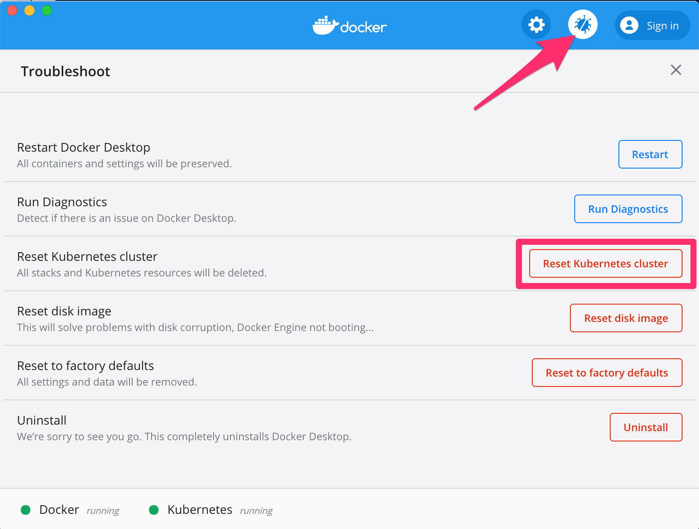

# Debug Things

# Issue 000001 (): If namespace deletion is stuck locally in docker desktop's kubernetes:
STATUS: 
This can be RESOLVED with manual click (see image below), but the TECH DEBT automation of this fix is TODO (I/We should automate this fix)
    - TODO (in order to automate the fix): need to find out the cli or api for hard resetting the local docker desktop kubernetes cluster and then add it to ansible and cli
Example error: 
`Error from server (Forbidden): error when creating "STDIN": secrets "dockerhub" is forbidden: unable to create new content in namespace kubify`
Investigation:
- Find out what resources are left in the stuck namespace with: `kubectl api-resources --verbs=list --namespaced -o name | xargs -n 1 kubectl get --show-kind --ignore-not-found -n kubify`
    - Example Output: `error: unable to retrieve the complete list of server APIs: mutators.kubedb.com/v1alpha1: the server is currently unable to handle the request, validators.kubedb.com/v1alpha1: the server is currently unable to handle the request`
        - This was from an old typo in the api version, already corrected it, makes sense now..
    - Helpful references of endpoints and versions: 
        - https://kubernetes.io/docs/reference/generated/kubernetes-api/v1.20/
        - https://kubedb.com/docs/v2021.03.17/guides/postgres/initialization/script_source/
    - RESOLUTION: I hard reset my local Docker Desktop's K8s to fix this:

